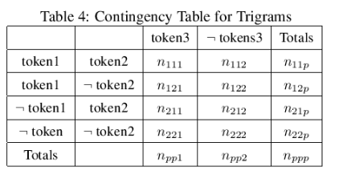
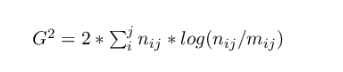
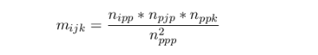

#Calculation log likelihood ration
The calculation based on the ["Extending the Log Likelihood Measure... thesis"](https://www.semanticscholar.org/paper/Extending-the-Log-Likelihood-Measure-to-Improve-Thesis-McInnes/5ded1a99057884a129b68d20092684bed2377ce0)
We calculate the contingency table for 3-grams:

To calculate the Log Likelihood we will use formula:

where mij is the expected value for the table cell and will be calculated by the formula:

